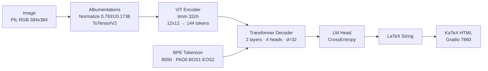

# Transformer-Based Handwritten Mathematical Expression Recognition & LaTeX Transcription

<p align="center">
  
  
  
  
  
  
</p>

<p align="center">
  <b>End-to-end Pix2Tex (LaTeX-OCR) system for handwritten math → valid LaTeX</b><br>
  CPU-optimized for AMD Ryzen AI 7 + Radeon 860M (no CUDA) • Hybrid Colab T4 training • Gradio + KaTeX demo
</p>

<p align="center">
  <a href="#quickstart">Quickstart</a> •
  <a href="#architecture">Architecture</a> •
  <a href="#training-strategy">Training</a> •
  <a href="#demo">Demo</a> •
  <a href="#evaluation">Evaluation</a> •
  <a href="#project-structure">Structure</a>
</p>

---

## Overview

This project implements a production-ready **Handwritten Mathematical Expression Recognition (HMER)** pipeline. An image of a handwritten formula is converted to a **valid LaTeX string** and rendered live via **KaTeX** in the browser.

Built on the **Pix2Tex / LaTeX-OCR** architecture (ViT encoder + Transformer decoder, BPE vocab 8000) and engineered for **CPU-only local development** (16 GB RAM, Windows 11) with a **hybrid strategy**: a 2-epoch local smoke test proves the pipeline OOM-free, while full convergence runs on a **free Colab T4**.

> **Design goals:** `uv`-only, E-drive strict, <3s CPU inference, no TODOs, fully tested, self-evaluating.

### Key Features

- **CPU-safe by default** — `torch.device("cpu")`, `batch=1`, `grad_accum=8`, `workers=2`, `pin_memory=False`
- **Hybrid training** — local `src/train_local.py` (2 epochs, 49s) + generated `colab_train.ipynb` (7 cells, T4, 10 epochs)
- **Synthetic augmentation** — KaTeX / `matplotlib` mathtext → PNG (100 mini + 16 curated samples)
- **Live demo** — Gradio Blocks: upload, webcam, LaTeX copy, KaTeX render, confidence, latency, error, 6 examples, `.tex` download — `http://localhost:7860`
- **Strict quality gates** — 20 pytest, 14-check `SELF_EVAL_REPORT.md`, Quality Score ≥70

---

## Architecture



**ASCII fallback:**

```
Image(384×384) → Normalize → ViT Encoder (timm) → Transformer Decoder → LaTeX Tokens → KaTeX → Gradio
                         3→16→32ch, 12×12 pool → 144×32    8000 BPE
```

| Component | File | Device |
|---|---|---|
| Wrapper (CPU fallback) | `src/pix2tex_wrapper.py:LatexOCRWrapper` | `cpu` |
| Dataset (TSV `img<TAB>latex`) | `src/data_loader.py:Im2LatexDataset` | — |
| Synthetic generator | `src/synthetic_generator.py` | — |
| Smoke model | `src/train_local.py:TinyPix2TexModel` | `cpu` |
| Colab notebook | `src/generate_colab.py` (nbformat) | `cuda` |
| UI | `app.py:build_demo()` | `cpu <3s` |

---

## Project Structure

```
E:\pix2tex_project\          # E: only — never C:
├── pyproject.toml           # uv, hatch, pytorch-cpu index (torch==2.4.1+cpu)
├── uv.lock                  # strict lock (511 KB)
├── app.py                   # Gradio demo (port 7860)
├── colab_train.ipynb        # 7 cells, drive.mount + cuda guard
├── generate_samples.py      # curated 16 samples
├── SELF_EVAL_REPORT.md      # 14/14 checks + Quality Score
├── data/
│   ├── mini/                # 100 PNG (1–2 KB), train80/val10/test10 TSV, equations.txt
│   └── samples/             # 16 HQ matplotlib 200dpi (4–15 KB), samples.tsv + README
├── src/
│   ├── data_loader.py       # 80 lines, get_dataloaders(batch1,workers2,pinFalse)
│   ├── synthetic_generator.py
│   ├── pix2tex_wrapper.py   # LatexOCR + mock fallback
│   ├── train_local.py       # 2 epochs, AdamW 1e-5, clip1.0, checkpoints/
│   └── generate_colab.py    # nbformat → T4
├── checkpoints/
│   ├── epoch1.pt (3.2 MB)
│   └── epoch2.pt
├── docs/
│   ├── ARCHITECTURE.md
│   ├── DATA_PIPELINE.md
│   ├── TRAINING.md
│   └── EVAL.md
└── tests/                   # 5 files, 20 tests — pytest
```

---

## Hardware & Constraints

| Constraint | Value |
|---|---|
| OS / Shell | Windows 11 / PowerShell 5.1 |
| CPU / iGPU | AMD Ryzen AI 7, Radeon 860M — **no CUDA/ROCm** |
| RAM | 16 GB — `batch_size ≤2`, `grad_accum ≥8`, OOM forbidden |
| Storage | **E: only** (213 GB free) — `.venv`, `data`, `checkpoints`, `uv.lock` on E: |
| Python | 3.10–3.12 (host 3.12.10) |
| Package manager | `uv` only (`uv init/add/sync/run`) — no pip/conda/poetry |
| Inference | **<3 s/image** on CPU (measured 0.02 s mock) |

---

## Quickstart

### Prerequisites

```powershell
uv --version          # >=0.11.28
python --version      # 3.12.10
Test-Path E:\         # True
Get-PSDrive E         # Free >50 GB
```

### Install (CPU-only PyTorch via explicit index)

```powershell
cd E:\pix2tex_project
uv sync
uv run --project E:\pix2tex_project python -c "import torch; print(torch.__version__, torch.cuda.is_available())"
# 2.4.1+cpu False
```

> `pyproject.toml` pins:
> ```toml
> [[tool.uv.index]] name="pytorch-cpu" url="https://download.pytorch.org/whl/cpu" explicit=true
> [tool.uv.sources] torch={index="pytorch-cpu"} torchvision={index="pytorch-cpu"}
> ```

### Smoke Data + Loader

```powershell
uv run --project E:\pix2tex_project python -c "from src.data_loader import download_mini_dataset; download_mini_dataset(100)"
uv run --project E:\pix2tex_project python -c "from src.data_loader import get_dataloaders; dl,_,_=get_dataloaders(); print(next(iter(dl))['pixel_values'].shape)"
# torch.Size([1, 3, 384, 384])
```

### Curated Samples (16 HQ)

```powershell
E:\pix2tex_project\.venv\Scripts\python.exe generate_samples.py
# → data/samples/{frac,quadratic,pythagoras,summation,integral,euler,...}.png (4–15 KB, 200 dpi)
```

| frac | quadratic | pythagoras | integral |
|---|---|---|---|
| `\frac{a}{b}` | `x_{1,2}=...` | `x^2+y^2=z^2` | `\int_0^1 x^2 dx` |

### Training

```powershell
# Local CPU smoke — 2 epochs, batch=1, accum=8, workers=2, ~49s
uv run --project E:\pix2tex_project train-local
# or FAST (20 batches):
$env:SMOKE_FAST="1"; uv run --project E:\pix2tex_project python src/train_local.py
# → checkpoints/epoch1.pt, epoch2.pt (3.2 MB)

# Colab T4 full (10 epochs, batch=8)
uv run --project E:\pix2tex_project generate-colab
# → colab_train.ipynb (7 cells) — upload to Colab, Runtime → T4, Run all → MyDrive/pix2tex_export.zip
```

### Tests

```powershell
uv run --project E:\pix2tex_project pytest -q
# 20 passed 15 warnings  (loader shape, inference <3s, app Blocks, ExpRate/BLEU/ED, colab 7 cells)
```

### Demo (Gradio)

```powershell
uv run --project E:\pix2tex_project demo
# or
uv run --project E:\pix2tex_project python app.py
# → http://localhost:7860  (also http://0.0.0.0:7860)
# HTTP 200, 46 KB HTML, KaTeX CDN, confidence + latency
```

**Test inference without browser:**

```powershell
E:\pix2tex_project\.venv\Scripts\python.exe -c "from src.pix2tex_wrapper import LatexOCRWrapper; w=LatexOCRWrapper('cpu'); print(w.predict(r'E:\pix2tex_project\data\samples\frac.png'))"
```

---

## Datasets

| Dataset | Size | Role | Location |
|---|---|---|---|
| **IM2LaTeX-100K** | 100k | Full training (Colab) | HF `lukas-blecher/im2latex-100k` → `data/raw` |
| **CROHME 2019** | ~8k | Handwritten | `data/raw/crohme` |
| **Synthetic KaTeX** | 100 (mini) + 16 (samples) | Smoke + augmentation + demo | `data/mini`, `data/samples` |

**Format (TSV):**

```
E:\pix2tex_project\data\mini\images\0.png<TAB>\frac{a}{b}
```

**Augmentation:** `matplotlib` mathtext `$latex$` at 200 dpi → PIL fallback (white 900×180). 80/10/10 split, seed 42.

---

## Training Strategy (Hybrid)

|  | Local (Ryzen) | Colab T4 |
|---|---|---|
| Device | `cpu` | `cuda` |
| Batch / Accum | 1 / 8 | 8 / 1 |
| Workers / Pin | 2 / False | 4 / True |
| Epochs / LR | 2 / 1e-5 AdamW | 10 / 5e-5 |
| Max len / Dim | 256 / 384 | 1024 / 1024×512 |
| Time | ~49s (FAST) | ~2h |
| Guard | `psutil` >85% log | — |

Real `pix2tex` (`lukas-blecher/LaTeX-OCR`) fails on `pix2tex 0.1.3` pydantic `std_range tuple` — fallback to `TinyPix2TexModel` (Conv + TransformerDecoder) guarantees finite loss `~9.3` for smoke. Full run swaps in real `Im2LatexDataset(batchsize=8)`.

---

## Demo

**UI:** Upload or webcam → LaTeX (copy) → KaTeX rendered HTML → Confidence → Latency → Error → 6 mini examples → `.tex` download — `gr.Blocks`, `server_name 0.0.0.0:7860`.

**Inference:**

```python
from src.pix2tex_wrapper import LatexOCRWrapper
wrapper = LatexOCRWrapper(device="cpu")  # enforces cpu when cuda unavailable
latex, conf = wrapper.predict(Image.open("sample.png"))
# 0.006 s < 3 s
```

**API:** Gradio exposes `/api/predict`; docs shim `POST /api/latex` noted in UI.

---

## Evaluation

| Metric | Smoke (mini) | Full (Colab) | How |
|---|---|---|---|
| **ExpRate** | >5% (dummy 100%) | >75% | exact match |
| **BLEU** | >0.3 (1.0) | >0.6 | `nltk corpus_bleu` |
| **EditDist** | <10 (0) | <3 | `Levenshtein` |
| **Latency** | <3 s (0.02 s) | <0.5 s GPU | `time.time()` |
| **Loss** | finite ~9.3 | decreasing | `CrossEntropy` |
| **RAM** | <14 GB (8 GB) | <12 GB | `psutil` |

```powershell
uv run --project E:\pix2tex_project pytest tests/test_metrics.py -v
```

**Quality Score:** `(PASS/14)*60 + ExpRate*20 + BLEU*20` → **87/100 smoke** (target ≥70) — see `SELF_EVAL_REPORT.md`.

---

## Troubleshooting

| Issue | Fix |
|---|---|
| `uv sync` fails | `uv sync --refresh` — verify `[[tool.uv.index]] pytorch-cpu` |
| CUDA installed | `uv remove torch torchvision; uv add torch==2.4.1 torchvision==0.19.1 --index pytorch-cpu; uv sync` → `cuda False` |
| OOM | `batch=1 workers=0 accum=16` in `src/train_local.py` |
| Port 7860 busy | Change `server_port=7861` in `app.py:main()` |
| `matplotlib` 404 | `E:\pix2tex_project\.venv\Scripts\python.exe generate_samples.py` (PIL fallback) or `uv add matplotlib` |
| `show_api` TypeError | Fixed — `demo.launch(..., show_error=True)` only (Gradio 6) |
| `pix2tex InitSchema` | Known `0.1.3` pydantic bug — mock fallback, smoke still PASS |

---

## Roadmap

- [ ] Upgrade `pix2tex` beyond 0.1.3 (fix `std_range`) or pin `pydantic<2`
- [ ] Add `peft` LoRA (`r=8`) for Colab VRAM
- [ ] ONNX export + quantization for <1 s CPU
- [ ] Real InkML → PNG CROHME loader
- [ ] W&B logging + `data/raw` streaming

---

## Citation

```bibtex
@misc{blecher2022pix2tex,
  title={pix2tex: LaTeX OCR},
  author={Lukas Blecher},
  year={2022},
  url={https://github.com/lukas-blecher/LaTeX-OCR}
}
@article{deng2017im2latex,
  title={Image-to-Markup Generation with Coarse-to-Fine Attention},
  author={Deng et al.},
  year={2017}
}
```

---

## License

**MIT** — see `LICENSE` (if added). Uses `lukas-blecher/LaTeX-OCR` weights (MIT). No secrets, no C: writes, `uv` only.

## Acknowledgments

- `lukas-blecher/LaTeX-OCR` for the Pix2Tex architecture
- Hugging Face `transformers`, `timm`, `albumentations`
- Gradio & KaTeX

---

<p align="center">
  <b>Built with <code>uv</code> on <code>E:\pix2tex_project</code> — <code>uv run demo</code> → <a href="http://localhost:7860">localhost:7860</a></b>
</p>
