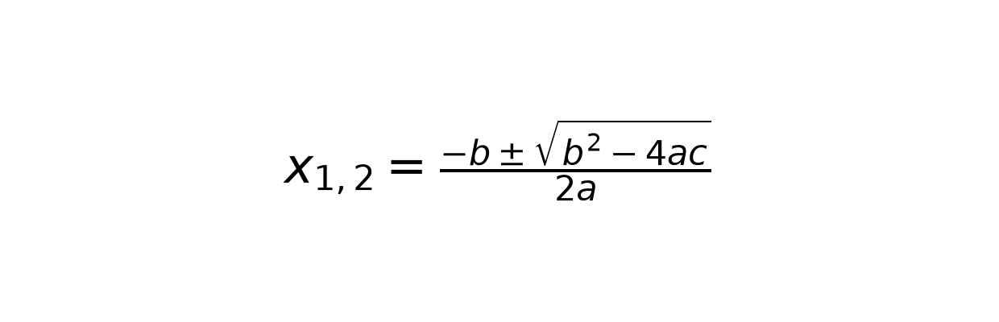
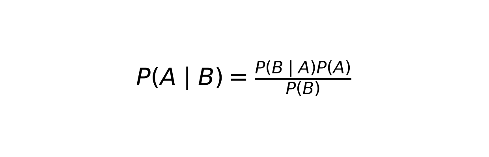

# Sample Images for Testing

Curated 16 expressions rendered via matplotlib mathtext (dpi 200).

| File | LaTeX | Preview |
|---|---|---|
| `frac.png` | `\frac{a}{b}` |  |
| `quadratic.png` | `x_{1,2} = \frac{-b \pm \sqrt{b^2-4ac}}{2a}` |  |
| `pythagoras.png` | `x^2 + y^2 = z^2` |  |
| `summation.png` | `\sum_{i=1}^{n} x_i = S` |  |
| `integral.png` | `\int_0^1 x^2 \, dx = \frac{1}{3}` |  |
| `euler.png` | `e^{i\pi} + 1 = 0` |  |
| `alpha_beta.png` | `\alpha + \beta = \gamma` |  |
| `limit.png` | `\lim_{x \to \infty} \frac{1}{x} = 0` |  |
| `sqrt.png` | `\sqrt{2\pi r}` |  |
| `matrix.png` | `[a\ b;\ c\ d]` |  |
| `binomial.png` | `\binom{n}{k} = \frac{n!}{k!(n-k)!}` |  |
| `vector.png` | `\vec{F} = m \vec{a}` |  |
| `maxwell.png` | `\nabla \cdot \mathbf{E} = \frac{\rho}{\varepsilon_0}` |  |
| `prob.png` | `P(A \mid B) = \frac{P(B \mid A) P(A)}{P(B)}` |  |
| `continued_frac.png` | `\frac{1}{1 + \frac{1}{2}}` |  |
| `derivative.png` | `\frac{d}{dx} x^n = n x^{n-1}` |  |

## Usage

```powershell
uv run python app.py  # then drag any PNG into Gradio
uv run python -c "from src.pix2tex_wrapper import LatexOCRWrapper; w=LatexOCRWrapper('cpu'); print(w.predict(r'E:\pix2tex_project\data\samples\frac.png'))"
```

Total: 16 samples in `E:\pix2tex_project\data\samples`
